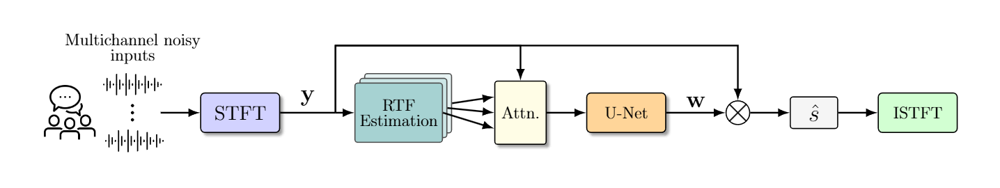

# Linearly Constrained Deep Beamformer For Multi-Speaker Scenarios
**[Demo Page](https://GannotLab.github.io/LC-DeepBeam-Demo/)**

## Description
We propose a deep beamforming framework for enhancing target speaker(s) in multi-speaker environments. A deep neural network
(DNN) is trained to estimate beamforming weights directly from noisy multichannel inputs while satisfying linear spatial constraints through an adaptive multi-term loss inspired by the augmented Lagrangian framework. The loss combines signal reconstruction with penalties that enforce a distortionless response toward the target and suppress the interference subspace. The model is further guided by the target relative transfer function (RTF) and the estimated interference subspace. The proposed model can direct a beam toward the target speaker while directing nulls toward the interfering sources, achieving superior overall enhancement performance compared with the classical LCMV beamformer constructed by the same estimated spatial signatures. Furthermore, compared with the LCMV beamformer, the proposed model produces more controlled sidelobes and improved background-noise attenuation.

## Architecture

## Key Features
* U-Net architecture with attention
* Uses Relative Transfer Function (RTF) for spatial guidance
* Enforces:
  * Target preservation (distortionless response)
  * Interference suppression (null steering)
* Fully DNN-based (no classical beamformer required)

## Method
* Input: multichannel noisy audio + RTF features
* Output: beamformed enhanced speech
* Training uses a multi-term loss combining:
  * Signal reconstruction (SI-SDR)
  * Spatial constraints (pass & null)
